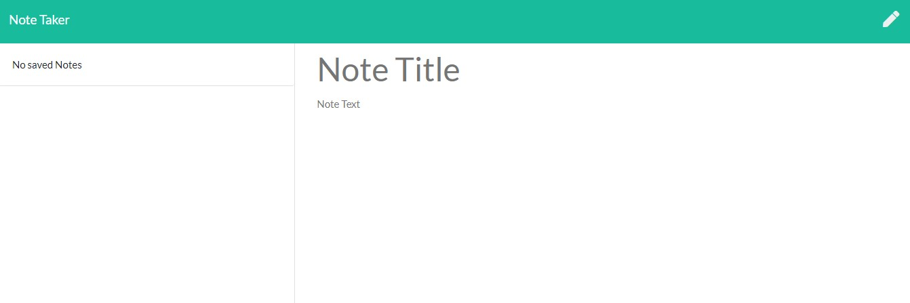
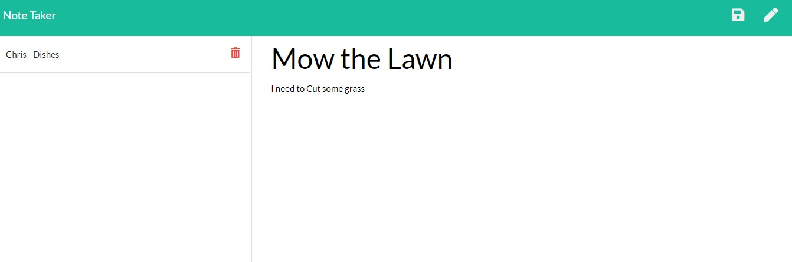

# Express-Note-Taker

This weeks assignment was to design the backend server for a Task tracker, it is very similar to a assignment we had where we had to store "To Dos" to the local storage as Json but in this case we went a further step to save to an external JSON file that is required into the database. For our backend server we utilized the Express module that is vastly improved from the HTTP node module. The front was developed for us so the trickiest part of the assignment was working with pre-existing code and developing our own to work together to provide proper client use.

